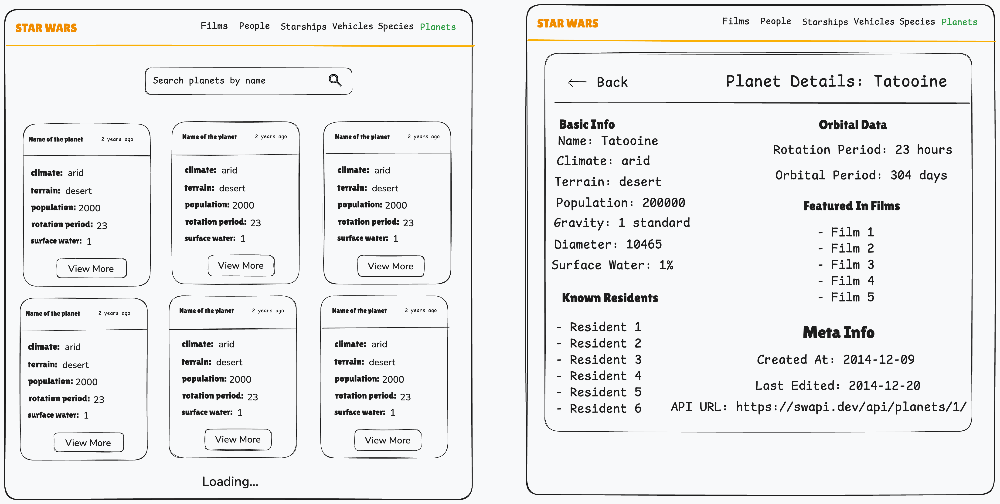
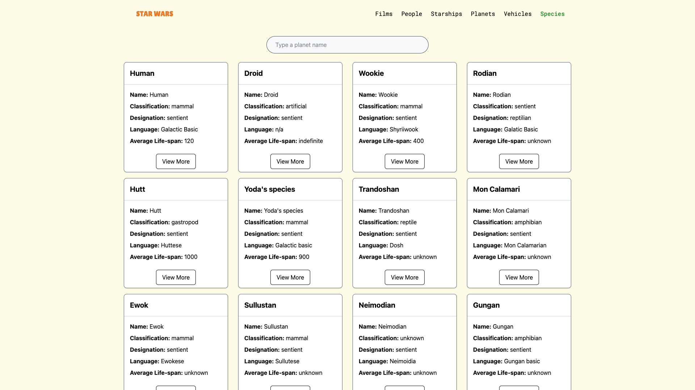
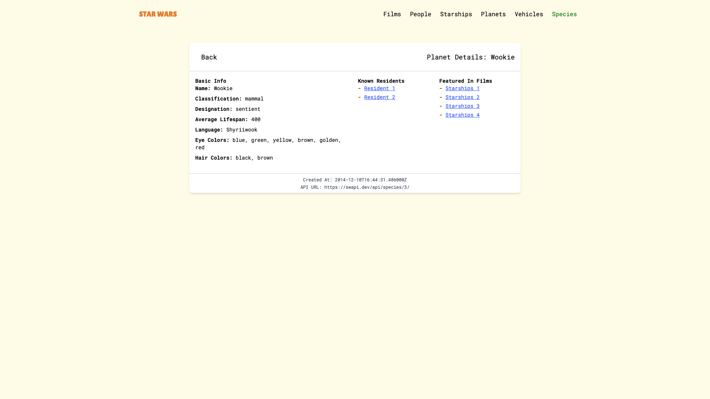
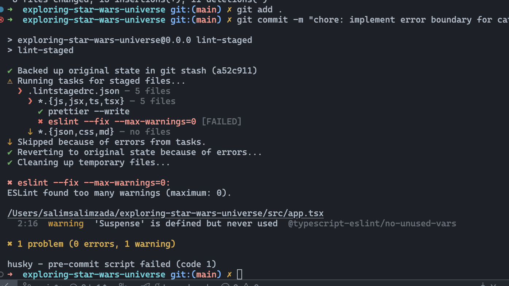
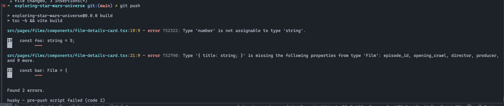

# Star Wars API Web Application

This repository contains the implementation of a technical task provided by PASHA Insurance as part of their interview process. The code is for evaluation purposes only and is **not intended for production use**.

## 🖼️ Wireframe

Here's the initial wireframe I created for the **Planets** list and details pages.  
This served as a visual guide during the early stages of development:



## Screenshots




## Features

### Pages

The application includes separate pages for each of the following resources:

- **Films**: Displays a list of Star Wars films.
- **People (Characters)**: Lists Star Wars characters and their details.
- **Starships**: Displays available starships in the Star Wars universe.
- **Vehicles**: Lists Star Wars vehicles and their specifications.
- **Species**: Shows various species in Star Wars.
- **Planets**: Displays information about different planets in the Star Wars galaxy.

### Infinite Scrolling

The application dynamically fetches and displays resources as the user scrolls down the page, improving the user experience without requiring a page reload.

### Custom UI Components

The application is designed with **custom, reusable components**, ensuring a consistent and maintainable user interface.

### State Management and Data Fetching

- **Tanstack Query** is used for data fetching from the Star Wars API to optimize network calls and data management.

### Performance Optimization and Error Handling

- **Lazy Loading**, **Suspense**, and **Error Boundaries** were implemented to enhance performance, handle errors, and improve overall user experience.

### Testing

- Test cases were written for utility functions to ensure the correctness and maintainability of the codebase.

### Code Quality

- Set up **Husky** with **lint-staged** to enforce linting and formatting rules on commits and pre-push actions:
- **ESLint Warning Block on Commit**: Blocks commits if there are any ESLint warnings.
- **Pre-Push Block on Commit**: Blocks pushes if any issues are detected during the pre-push checks.
- Configured **Prettier** and **ESLint** to ensure a consistent code style across the project.

## Screenshots

#### ESLint Warning Blocks Commit



> Commits are blocked if any linting warnings or errors are present.

#### Pre-Push Hook Blocks Push



> Code cannot be pushed unless all checks pass, ensuring consistency and reliability.

## Installation

```bash
  git clone git@github.com:salimsalimzada/exploring-star-wars-universe.git
  cd exploring-star-wars-universe
  npm install
  npm run dev
```

## Environment Variables

To run this project, you'll need to add the required environment variables to your `.env` file. For simplicity, you can use `.env`, but you can also create environment-specific files such as `.env.local` or `.env.production`.

Below are the key environment variables that need to be set (also listed in `.env.example`):

- `VITE_ENV=development`
- `VITE_BASE_URL=<your-base-url>`

Please refer to the `.env.example` file for any additional configuration.
